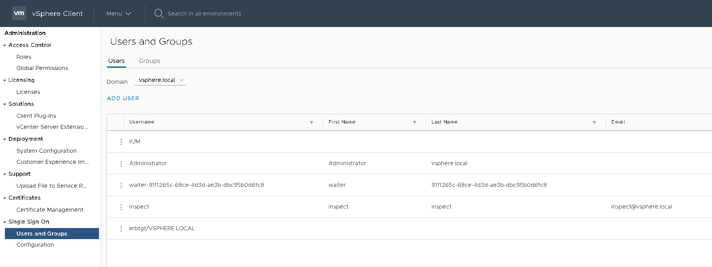
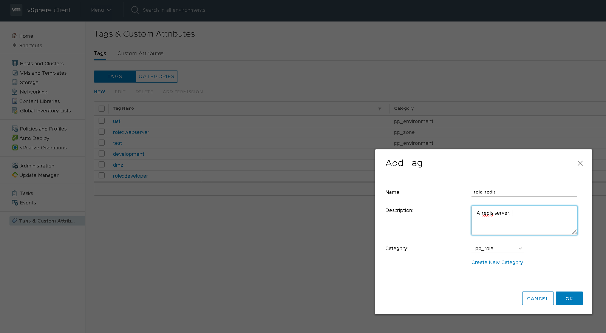
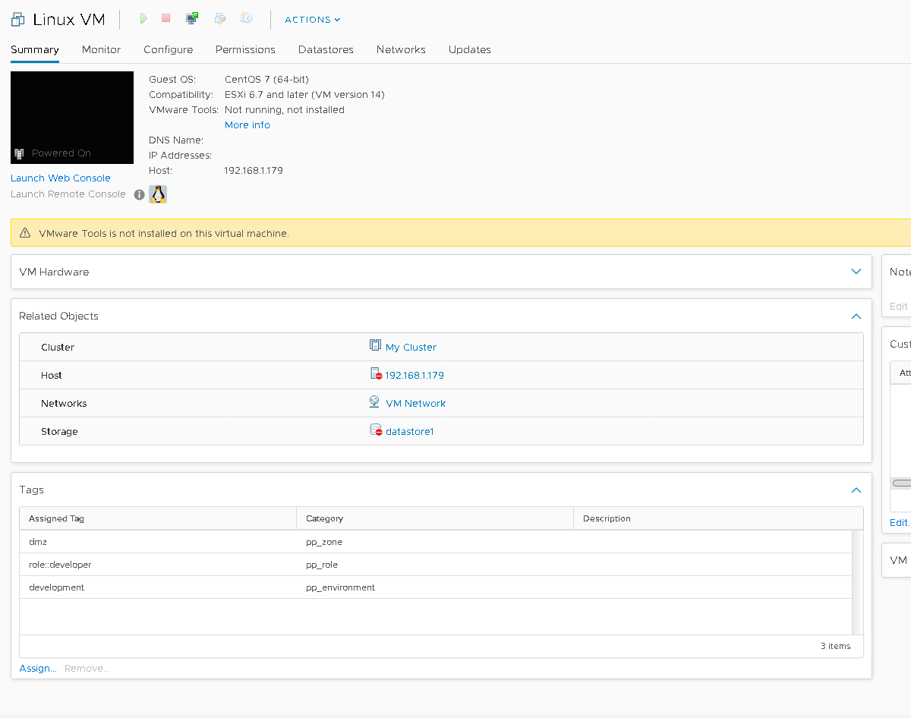

# VCenter/Puppet Provisioning overview

## VCenter setup
1. Create a VCenter user `inspect` that is able to read tags values _only_

    
2. Create desired categories
    * Categories map exactly to the list of 
      [custom OIDs for Puppet](https://puppet.com/docs/puppet/6.0/config_file_oid_map.html)
      eg:
        * `pp_role`
        * `pp_environment`
        * `pp_zone`
        * ...etc
3. Assign tags to categories

    
    * Tags are the allowed values for categories, eg:
        * `role` could be `role::developer`
        * `customer_env` could be `test`
        * `zone` could be `dmz`
        * ...etc
4. Tags need to be added as new requirements emerge. A new `role` requires a
   corresponding new tag

   

## Image setup
Images for Windows and Linux to be modified as described below to
register with Puppet on first boot.

## Network setup
Newly provisioned VMs need to be able to hit the VCenter REST API which lives
on the VCenter server port 443

## VM First boot
Puppet will be automatically configured during first boot. This involves:

1. Run a script (Python for Linux, PowerShell for Windows) that:
    1. Resolves the Puppet Master to use
    2. Resolves the name of the current VM (FQDN as the VM name
       in VSphere would make this very easy)
    3. Lookup all applicable tags and resolve their values using the VCenter 
       API using the credentials of the read-only `inspect` account describe
       above. These credentials need to be stored inside the script/script
       config file and would be used to ask VCenter for the list of trusted
       facts, eg:
        * role
        * zone
        * customer_env
        * ...etc
    4. Obtain the puppet autosign password somehow - eg (open to ideas):
        * Lookup from VMWare tags
        * Bake into image
        * Retrieve from some other password source
        * Investigate other autosigning techniques, 
          [autosign gem](https://forge.puppet.com/danieldreier/autosign) seems
          to be the go-to method these days but seems to move the problem around
          IMO
    5. Run the custom CURL command
        * If successful, Puppet 
    6. When puppet first runs, suggest we have a `profile::cleanup` that removes
       all of the above, leaving an adapted version of Saxon's signup script\

## Config file
puppet_bootstrap requires a config file (ini format) to provide details of
VMWare and Puppet Enterprise server. You can also use it to build a menu

The same config file can be used for both Windows and Linux

### VMWare
Under section `[main]`:
* username
* password
* server (URL of VCenter API)

## Puppet
Under section `[main]`:
* puppet_master_host
* puppet_master_ip
* shared_secret (challengePassword)

## Menu
Build a menu using the format:
```ini
PUPPET_OID_NAME=list,of,allowed,values
```

* Use the special value `nothing` to indicate no answer is required for a
  particular field

**Example**

```markdown
[main]
username = inspect@vsphere.local
password = Password123!
server = https://photon-machine.lan.asio
puppet_master_host = localhost
puppet_master_ip = 127.0.0.1
shared_secret = changeme

[menu]
pp_environment = dev,test,uat
pp_zone = nothing,dmz
pp_role = role::base,role::webserver
```  

# How to setup a new VM

## Using VCenter (preferred)
1. Create a new VM
2. Assign tags from the allowed list by clicking `Assign`



3. Start the VM, it will boot and register with Puppet over the next few minutes

## Using menu (for troubleshooting)
1. On the puppet master, purge existing certificate (`puppet node purge CERTNAME.OF.VM`)
2. On the node, run the `puppet_bootstrap` in interactive mode:
    * Linux: `./puppet_bootstrap --interactive`
    * Windows: `.\puppet_bootstrap.ps1 -Interactive`
3. Follow the prompts which build a menu from the config file, you must type
   `yes` and hit return at the end of the interview