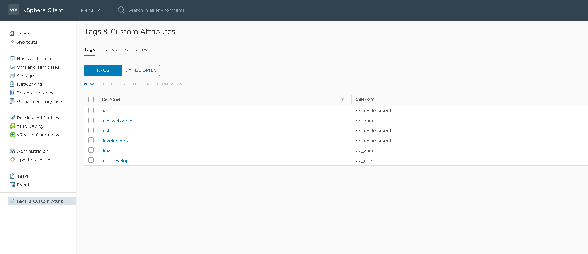

# VCenter/Puppet Provisioning overview

## VCenter setup
1. Create a VCenter user `inspect` that is able to read tags values _only_

    
2. Create desired categories
    * Categories map exactly to the list of 
      [custom OIDs for Puppet](https://puppet.com/docs/puppet/6.0/config_file_oid_map.html)
      eg:
        * `pp_role`
        * `pp_environment`
        * `pp_zone`
        * ...etc
3. Assign tags to categories

    
    * Tags are the allowed values for categories, eg:
        * `role` could be `role::developer`
        * `customer_env` could be `test`
        * `zone` could be `dmz`
        * ...etc
4. Tags need to be added as new requirements emerge. A new `role` requires a
   corresponding new tag

   

## Network setup
Newly provisioned VMs need to be able to hit the VCenter REST API which lives
on the VCenter server port 443

## VM First boot
Puppet will be automatically configured during first boot. This involves:

1. Run a script (Python for Linux, PowerShell for Windows) that:
    1. Resolves the Puppet Master to use
    2. Resolves the name of the current VM (FQDN as the VM name
       in VSphere would make this very easy)
    3. Lookup all applicable tags and resolve their values using the VCenter 
       API using the credentials of the read-only `inspect` account describe
       above. These credentials need to be stored inside the script/script
       config file and would be used to ask VCenter for the list of trusted
       facts, eg:
        * role
        * zone
        * customer_env
        * ...etc
    4. Obtain the puppet autosign password somehow - eg (open to ideas):
        * Lookup from VMWare tags
        * Bake into image
        * Retrieve from some other password source
        * Investigate other autosigning techniques, 
          [autosign gem](https://forge.puppet.com/danieldreier/autosign) seems
          to be the go-to method these days but seems to move the problem around
          IMO
    5. Run the custom CURL command
        * If successful, Puppet 
    6. When puppet first runs, suggest we have a `profile::cleanup` that removes
       all of the above, leaving an adapted version of Saxon's signup script\


## Config file
puppet_bootstrap requires a config file (ini format) to provide details of
VMWare and Puppet Enterprise server. You can also use it to build a menu for
picking a list of pre-set values from a list.

The same config file can be used for both Windows and Linux and should be stored
at one of:

* Linux - `/etc/puppet_bootstrap/puppet_bootstrap.cfg`
* Windows - `c:\ProgramData\puppet_bootstrap\puppet_bootstrap.cfg`

### VMWare
Under section `[main]`:
* username
* password
* server (URL of VCenter API)

## Puppet
Under section `[main]`:
* puppet_master_host - FQDN of Puppet Master
* puppet_master_ip - IP Address of Puppet Master
* shared_secret - challengePassword for autosigning 

## Menu
Build a menu using the format:
```ini
PUPPET_OID_NAME=list,of,allowed,values
```

* Use the special value `nothing` to indicate no answer is required for a
  particular field

**Example**

```ini
[main]
username = inspect@vsphere.local
password = Password123!
server = https://photon-machine.lan.asio
puppet_master_host = localhost
puppet_master_ip = 127.0.0.1
shared_secret = changeme

[menu]
pp_environment = dev,test,uat
pp_zone = nothing,dmz
pp_role = role::base,role::webserver
```  

## VMWare image/template setup
To support the above process, your base OS image needs:

**Linux**
* `puppet_bootstrap.cfg` at `c:\etc\puppet_bootstrap\puppet_bootstrap.cfg`
* `puppet_bootstrap` at a location of your choice and configured to run as 
  `root` on first boot
* `requests` python library installed (`yum install -y python-requests`)

**Windows**
* `puppet_bootstrap.cfg` at 
  `c:\ProgramData\puppet_bootstrap\puppet_bootstrap.cfg`
* `puppet_bootstrap.ps1` at a location of your choice and configured to run as 
  `Administrator` on first boot


# How to setup a new VM

## Using VCenter (preferred)
1. Create a new VM
2. Assign tags from the allowed list by clicking `Assign`


3. Start the VM, your base template/image should have configured the 
`puppet_bootstrap` script to load on first boot, this will register the VM with
 Puppet Enterprise over the next few minutes

## Using menu (for troubleshooting)
We suggest _only_ using VMWare tags for management of live systems to ensure
consistent metadata, however, menu-based trusted fact assignment is useful in
some circumstances and especially for troubleshooting

1. On the puppet master, purge any existing certificate 
   (`puppet node purge CERTNAME.OF.VM`)
2. On the node, run the `puppet_bootstrap` in interactive mode:
    * Linux: `./puppet_bootstrap --interactive`
    * Windows: `.\puppet_bootstrap.ps1 -Interactive`
3. Follow the prompts which build a menu from the config file, you must type
   `yes` and hit return at the end of the interview
   
# Tips and Tricks
* By default we lookup the FQDN of the current host from VCenter to obtain tags,
  you can chose to override this with the `--vm-name` argument (Linux) or 
  `-vmName` (Windows)
* Online help is built-in
* You may supply a different `certname` (VM name in puppet) with the 
  `--certname` (Linux) or `-Certname` (Windows) argument
* You can use any of the Puppet custom OIDs you like - just start using them
  in the VCenter or the menu in the config file. Puppet custom OIDs all start 
  `pp_`
* If no tags are found for a VM in VMWare, the bootstrap script will stop. This
  is to prevent accidentally signing a bad certificate. If your sure no tags
  need setting, run with `--force` (Linux) or `-Force` (Windows) to install
  anyway
* We suggest you provision VMs using the machine FQDN as the VM name in order to
  have consistent naming across both VMWare and Puppet Enterprise. If your site
  has a different convention, you can supply a different VM Name to lookup in
  VCenter on the commandline, eg to use short hostname for VMware and FQDN for 
  Puppet:
    * Linux: `./puppet_bootstrap -vm-name $(hostname -s)`
    * Windows: `powershell -file .\puppet_bootstrap.ps1 -VmName ($env:computerName|out-string)`

# Security concerns

At some point it becomes necessary to have cleartext credentials in order to
bootstrap the system automatically. The alternatives to this would be:
* Halt bootup to ask user for credentials manually
* Lookup credentials from another system (cyberark ,vault, etc) but this itself
  would require credentials and likely the installation of additional client
  software too
* Access a locally available network-based credential store. Cloud-based VMs
  have access to various native credential stores (eg AWS IAM, Azure MSI) that
  are available at the network layer on a per-vm basis. There does not appear to
  be a VMWare alternative at present.

## VCenter

**Concern**

* VCenter credentials to lookup tags are present in `puppet_bootstrap.cfg`

**Mitigation** 

* Credentials should be lowest possible access - only able to read
  tags and basic VM info 
* Puppet should be configured to delete the file containing credentials once
  operational

## Puppet

**Concern**
* Puppet Enterprise has been configured to recognise nodes presenting a 
  _shared secret_ as authentic and this is present in `puppet_bootstrap.cfg`

**Mitigation**
* The _shared secret_ is only used to grant access to management _by_
  Puppet  
* Puppet should be configured to delete the file containing credentials once
  operational
* Alternatively, manual certificate signing could be used or this project could
  be extended to lookup/confirm details in VMWare and sign automatically based
  on correct values
  
## Windows

**Concern**

* Global SSL certificate validation disabled during script execution in order
  to allow self-signed certificates to be accepted from Puppet/VCenter. This is
  necessary as the `invoke-webrequest` commandlet shipping with mainstream
  Windows releases do not yet support `-SkipCertificateCheck` present in the
  latest upstream PowerShell releases
  
**Mitigation**

* Reboot to restore normal SSL certificate validation


# Troubleshooting
* Enable debug/verbose mode to trace the commands being run:
    * Linux: `--debug`
    * Windows: `-Debug -Verbose`
* Puppet Agent needs complete uninstall in order to correctly attach tags
* Puppet Master/Puppet Agent clocks must be within 5 minutes of each other or
  you will get certificate validation errors
* If you need to re-issue a certificate, the old one needs to be cleaned from
  the Puppet Master first: `puppet node purge certname.to.purge`
* Node must be able to reach the VCenter API (port 443)
* Node must be able to reach the Puppet Master (port 8140)
* Windows VMs won't have a domain name until they are joined to a domain. If you
  need to supply one to match name set in VMWare or desired in Puppet Enterprise
  you can do so on the command line:
  ```powershell
  `-VmName ($env:computerName + ".megacorp.infra") -Certname ($env:computerName + ".megacorp.infra")`
  ```